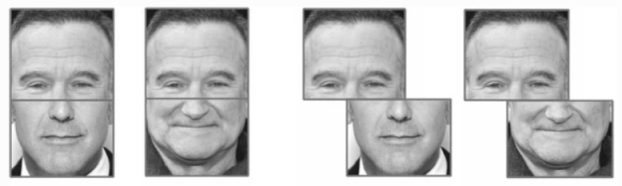

# Cognitive Psychology demos

I used plain JavaScript and the [Canvas API](https://developer.mozilla.org/en-US/docs/Web/API/Canvas_API) of HTML5 to program animations and interactive experiments to demonstrate principles of cognitive psychology in my classes. 

## Simon effect

The [Simon effect](https://en.wikipedia.org/wiki/Simon_effect) is a kind of response compatibility effect. It says that when you respond to a property (e.g., the colour of an object) using your left and right hands, you are likely to do it quicker and better if the thing appears on the same side of the response. If it appears on the opposite side, your responses are slower and more erroneous.

This is a <ins>[demo](https://louiskhchan.github.io/class-demos/simon_effect/)</ins> of the effect that I made for my classes. Give it a try and see whether it works for you!

## Composite face effect

The [Composite face effect](https://link.springer.com/article/10.3758/s13423-016-1131-5) is a face perception phenomenon that demonstrates that we tend to see a face as a whole. As a result, it is generally challenging to focus on one part of a face while ignoring the rest. The composite face effect says that when you are asked to focus only on the top part of a face, your recognition is disturbed by the bottom part of the face. For example, in the above faces (the left pair), the top halves of the faces are all identical, but they *might* look slightly different since we automatically take the bottom half of the face (which is changed) into account. However, if the face halves are misaligned (the right pair), this effect goes away because the misalignment stops our brains from treating the image as a whole 'face'.

This is a <ins>[demo experiment](https://louiskhchan.github.io/class-demos/composite_effect/index.htm?id=testuser)</ins> that I wrote for my class.

## Visual sensory memory

Visual sensory memory is also called [iconic memory](https://www.simplypsychology.org/iconic-memory.html). When we see a visual image, our eyes and brains will keep the raw image for a very short while before it is passed to the next stage of visual processing and faints. But how did psychologists know there is such a transient memory? [George Sperling](https://en.wikipedia.org/wiki/George_Sperling) has demonstrated the existence of iconic memory by using an ingenious experimental design called the Partial Report paradigm.

This paradigm is not immediately straightforward for some students, so I wrote my <ins>[own version](https://louiskhchan.github.io/class-demos/sperling/index.htm?id=testuser)</ins> and made it an online experiment for my students to try it themselves. In the experiment, you have to report a row of letters among other rows. However, the indicator that tells you which row to answer comes shortly after the disappearance of the letters. Experiment results show that the indicator is still useful even so. It means that the sensory memory of the letters is still there when the indicator shows up.

## Temporal integration of colour and consciousness

This demo demonstrates the temporal limit that we can distinguish two colours. Click on the <ins>[demo](https://louiskhchan.github.io/class-demos/redblue/index.htm)</ins>, and you will see that as two colours flash more quickly, the two colours start to fuse, and you can no longer see the original colours.

This demo is also related to a subtle distinction between our brain process and conscious awareness. A study by [Gur and Snodderly (1997)](https://www.sciencedirect.com/science/article/pii/S0042698996001836?via%3Dihub) used this stimulus to show that the temporal limit of separating colours by V1 cells in monkeys' brains is higher than that of the subjective report of the monkey. This result indicates that we are not conscious of everything that our brains can encode.

